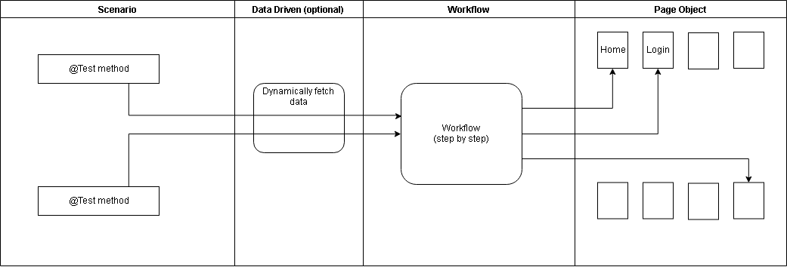

# java-e2e-automation-seed

**Promoting high cohesion, low coupling, code reuse and DRY principle**

**Scenario Layer:**
- *Should be the **@Test** methods with as little lines as possible*
- *As an alternative, you may use **@Theory** and configure the browsers you want to run your test. Each test will run once in each configuration*
- *Should be concise and easy to understand*

Example:

**Workflow Layer:**
- *Should have the actual step by step methods required by each scenario*
- *Should have the validation you intend to perform as well - Asserts*

Example:

**Benefits of above combination Scenarios + Workflow :**
- *One, well parameterized, Workflow can be used by multiple Test Scenarios.*
- *Structure allows for fast scenario design*

**Page Objects Layer:**
- *Should have the representation of each Page in your Application*
- *Each Page Object should have a representation of each element and action you take in that screen*
- *All Page Object classes should extend from Page Base class which already implements several useful methods*
- *A good practice is to use Enumerables to store all xpaths - the benefits of doing this is that: you will only need to change in one location if the xpath changes; you can leverage the xpath's following-sibling, ancestor and descendant for locating elements in Angular applications; and you can develop in parallel with the development team the overral structure of your test with Workflow and Page Objects, populating the xpaths latter*

Example:

**Data Driven (optional) Layer:**
- **IN CONSTRUCTION**

**Configuration Needed:**
- Access folder **ConstantsEnum** in order to configure specific configurations required for the automation to run
- Configurations such as : Initial Home URL, Chrome Driver location, Emulator related information and more.
- If you only have a static URL, you can use directly in the variable or you can load the variable with: System.getProperty("<variable_name>"); and pass the information at runtime